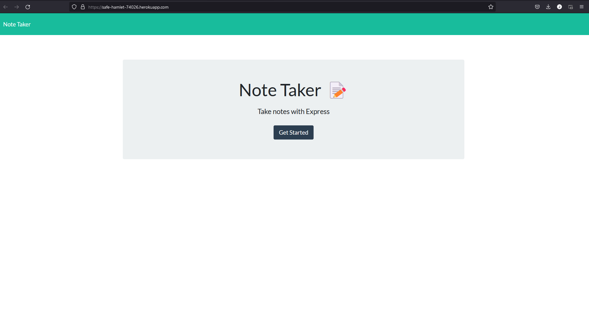

# note-taker

## Description

With this note taker, you are able to add notes to yourself and save them. Since it's server-side, it will store your notes even if you leave the website.

## Installation
Run npm -i to install any dependencies. However, the deployed site on Heroku should not need you install them

## Usage
Free to use.

## Images

## Future Development
Add the delete function to notes.